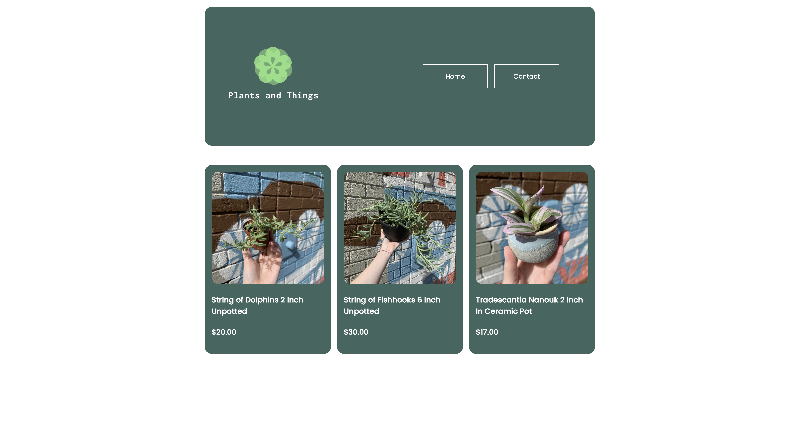
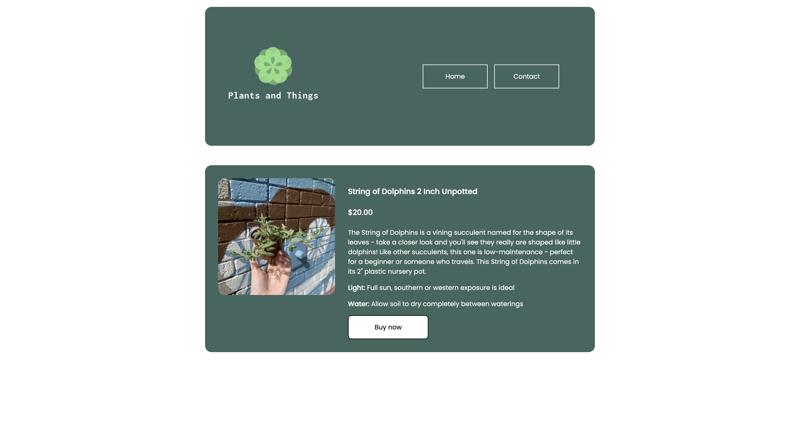
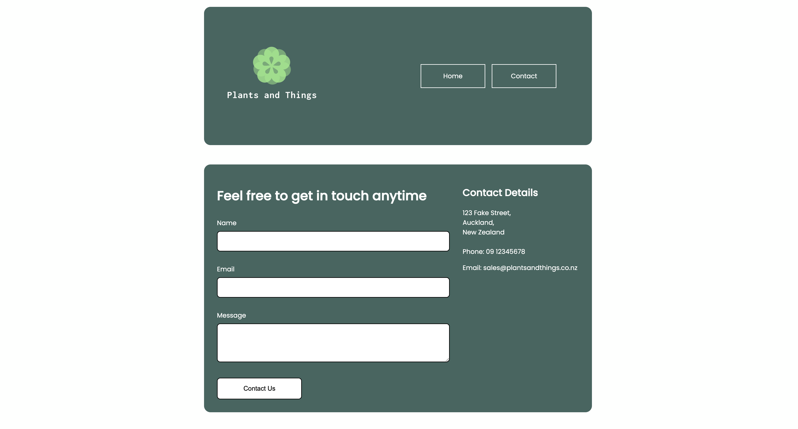

# HTML-CSS-Shop 

This was a project that was assigned to me by Developers Institute (please note that boiler plate code was provided).

## Learning Outcomes

- Demonstrate and apply Design Thinking principles and processes when considering the design of user experience (Ux).
- Implement responsive design (with device and platform independence) using basic principles of user interface design (UI), with considerations for user experience (Ux), HCI principles, and universal accessibility.
- Optimise client side media for the web, taking into consideration UX, cost, infrastructure requirements and scalability.
- Apply the basic principles of interaction design and human computer interaction employing current and emerging technologies.
- Apply and demonstrate user experience and usability concepts in IT.
- Implement hardware and software diagnostic testing, maintenance, technical and customer support across a range of devices.
- Demonstrate advanced technical knowledge of applications for supporting user requirements.
---
### Home Page

---

### Product Page

---

### Contact Page

--- 

### Deployed Website

- [Website](https://heuristic-banach-5a0a31.netlify.app/index.html)

---

### Dev Depencies

- [Prettier](https://prettier.io/docs/en/editors.html)
- [Stylelint](https://stylelint.io/)